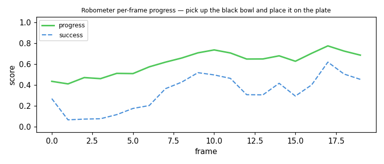
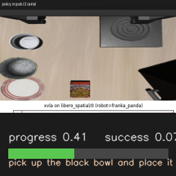
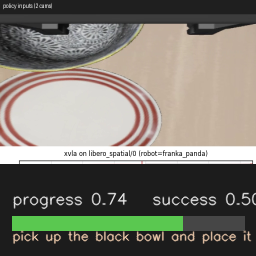
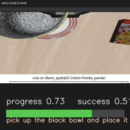

---
language:
- en
license: apache-2.0
pipeline_tag: robotics
tags:
- OpenRAL
- rskill
- nf4
- 4-bit
- any
- reward
- reward-model
- robot-learning
- progress-estimation
- success-detection
- qwen3-vl
- bitsandbytes
base_model:
- robometer/Robometer-4B
base_model_relation: quantized
inference: false
---

# rskill-robometer-4b-nf4

> **OpenRAL rSkill** — Robometer-4B (Qwen3-VL-4B robotic **reward foundation
> model**) packaged as an NF4 bitsandbytes `reward` rSkill. Given a
> rollout's RGB frames plus the task instruction, it emits **per-frame
> normalized progress (0–1)** and **per-frame success probability**, queried on
> demand by the Reasoner. **No actuators. Advisory-only.** Apache-2.0.

## Preview

Per-frame **progress** + **success** on a real **LIBERO `libero_spatial`** deploy
clip — task *"pick up the black bowl and place it on the plate"* — scored live
with the NF4 Qwen3-VL-4B backbone (peak **3.79 GB**, RTX 4070 Laptop 8 GB).
Progress rises from **0.44** (first 20% of frames) to **0.72** (last 20%) as the
bowl is grasped and placed:



| Start of clip | Mid-reach | Bowl placed |
| :---: | :---: | :---: |
|  |  |  |

> In deploy the Reasoner scores a **trailing window** each tick and reads the
> last-frame value (`success_now`) — exactly what this preview reproduces. HF
> cards render images but not HTML5 `<video>`; the full overlay is
> **[`media/progress.mp4`](media/progress.mp4)** (20 frames, downloadable).
>
> Runs the lerobot 0.6.0 in-tree `RobometerRewardModel` (plain `transformers`,
> no `robometer` git package, no `transformers==4.57.1` pin) — a lighter
> native-integration path than the original vendored-loader recipe (amended).

## Quick Start

```bash
ral skill install hf://OpenRAL/rskill-robometer-4b-nf4
```

```python
from openral_core.schemas import RSkillManifest

manifest = RSkillManifest.from_yaml("rskills/robometer-4b/rskill.yaml")
assert manifest.kind == "reward"
assert manifest.role == "s2"
assert manifest.reward.progress_range == (0.0, 1.0)
assert manifest.quantization.extra["scheme"] == "nf4"
assert manifest.is_commercial_use_allowed is True
```

## What It Does

Robometer is a general-purpose robotic reward model trained on RBM-1M (>1M
trajectories across diverse embodiments, including failures) with a dual
objective: a frame-level **progress** loss anchored on expert data and a
trajectory-comparison **preference** loss for global ordering. Given a task
instruction and a rollout video, it predicts per-frame progress (continuous
values over time) and per-frame success probability.

This rSkill declares `kind: reward` and `role: s2`: it is a pure perception
**consumer** operating at S2 (slow-reasoning) rate (~0.2–1 Hz), not an S1 fast
policy. It runs **in parallel with a `kind: vla` policy**, continuously
ingesting the VLA's camera frames into a rolling window, and the Reasoner
queries it on demand — *"how is success doing now / over the last X seconds?"* —
to decide whether to continue, escalate to a scene VLM (`query_scene`), advance
to the next subgoal, or enter the replanning ladder. It **never drives
`ros2_control` joints** and never gates motors (CLAUDE.md §1.1).

## Why a reward model alongside the VLA

A VLA policy emits actions but has no notion of whether it is *succeeding*.
Robometer closes that loop: it turns the camera stream into a normalized
per-frame progress + success signal the Reasoner can act on, so a stalled or
failing rollout triggers replanning instead of running to a timeout.

## Architecture

Robometer-4B finetunes `Qwen/Qwen3-VL-4B-Instruct` (`model_type: qwen3_vl`)
with three prediction heads — `progress_head`, `success_head`, `preference_head`
— on top of a frame-pooled attention readout (`frame_pool_attn`). The on-disk
HF `config.json` advertises `architectures: ["RFM"]`; OpenRAL loads it through
lerobot's in-tree `lerobot.rewards.robometer.RobometerRewardModel` and the
pre-quantized OpenRAL NF4 checkpoint, without executing the old upstream
`robometer` runtime package.

## Runtime

The `kind: reward` runtime is implemented as a read-only Reasoner tool
(`QueryTaskProgressTool`), **not** an `ExecuteSkill` (a reward monitor produces
scalars, not actions):

- **Reward monitor node**: `openral_perception_ros.reward_monitor_node` boots the
  NF4 model in-process, maintains a rolling time-indexed frame buffer
  (`frame_window_s`), and answers windowed progress/success queries. It loads via
  lerobot's in-tree `RobometerRewardModel` with plain `transformers`.
- **Frame source**: abstracted for **sim and real**. The reward monitor consumes the
  same `sensor_msgs/Image` camera topic the co-active VLA uses — fed by the
  GStreamer perception tee on real hardware, or by the sim HAL camera publisher
  in `deploy-sim` (which has no GStreamer). In `deploy-sim` only camera-rendering
  robots expose frames; absent frames surface as `ROSPerceptionStale`.
- **Reasoner tool**: the LLM sees the read-only `query_task_progress` tool when
  a reward rSkill is co-active with a VLA. It asks for the windowed assessment
  (`progress_now`, `success_now`, trends, `stalled`) and the answer feeds the
  next reasoning tick / the replanning ladder.

### Inference contract

Discrete (binned) mode yields the normalized signal OpenRAL consumes:
`compute_batch_outputs(..., sample_type="progress", is_discrete_mode=True,
num_bins=100)` returns `progress_pred` (per-frame ∈ [0,1]) and
`outputs_success["success_probs"]` (per-frame ∈ [0,1]). Continuous mode returns
raw, unnormalized regression values instead. Default sampling is 3 fps.

### Validated live

End-to-end on an **NVIDIA RTX 4070 Laptop (8 GB)**:

- **NF4 quantization**: 236 `Linear` modules → `Linear4bit`; **8.91 GB bf16 →
  3.33 GB resident**, **3.56 GB peak** including an 8-frame forward — **4.44 GB
  headroom** for a co-resident small NF4 VLA.
- **Working monitor**: streaming a real rollout video ("Put green stick in
  brown bowl") through the reward monitor, **progress ramped 0.21 → 0.88** and
  **success spiked to 0.90 exactly at task completion**, then eased — exactly
  the Reasoner signal intended.

Run with `PYTORCH_CUDA_ALLOC_CONF=expandable_segments:True`. The model loads via
lerobot's in-tree Robometer module with plain `transformers`.

## Benchmark Numbers

Paper-reported (Robometer team, March 2026, arXiv 2603.02115);
`reproduced_locally: false`. Robometer reports more generalizable reward
functions than prior methods (GVL, VLAC, RoboDopamine, TOPReward) across
benchmarks and real-world evaluations, improving downstream robot-learning
performance. See the paper for the full tables.

## Supported robots and embodiments

This reward monitor is **embodiment-agnostic** — it scores camera frames + a
task instruction and emits scalars, never actuator commands, so it imposes no
kinematic requirement. The only hardware dependency is an RGB camera stream of
at least 224×224. It pairs with any S1 VLA policy: the VLA acts, this model
reports whether the task is progressing / has succeeded.

## Sensors and Observation Contract

| Direction | Key | Modality | Shape / format | Notes |
|---|---|---|---|---|
| in | any RGB camera | RGB video frames | min 224 × 224 | the same topic the co-active VLA consumes |
| in | task instruction | text | natural language | required (`instruction_required: true`) |
| out | progress | float per frame | ∈ `progress_range` (`[0,1]`) | normalized task progress |
| out | success | float per frame | ∈ `[0,1]` | per-frame success probability |

The model emits no action chunks and has no proprioception contract.

## Manifest Summary

| Field | Value |
|---|---|
| `name` | `OpenRAL/rskill-robometer-4b-nf4` |
| `version` | `0.1.0` |
| `license` | `apache-2.0` |
| `role` / `kind` | `s2` / `reward` |
| `runtime` | `pytorch` |
| `quantization.dtype` / `scheme` | `int4` / `nf4` |
| `weights_uri` | `hf://OpenRAL/rskill-robometer-4b-nf4` (pre-quantized NF4, meta-loadable; built from the SHA-pinned upstream `source_repo`) |
| `min_vram_gb.bf16` | 9.0 GB |
| `min_vram_gb.int4` | 3.6 GB |
| `reward.frame_window_s` / `target_fps` | 40.0 s / 3.0 fps (a later reward-window amendment — scores the whole attempt start→now, not an 8 s trailing slice) |
| `reward.progress_range` / `success_threshold` | `[0,1]` / 0.5 |
| `latency_budget.per_chunk_ms` | 3000 ms |
| `actions` | `monitor` |

## License

The rSkill package metadata and README are OpenRAL project files under
Apache-2.0. The wrapped Robometer-4B weights are released under **Apache-2.0**,
permitting commercial use. No `OPENRAL_ALLOW_NONCOMMERCIAL=1` flag is needed.
The reward model now loads through lerobot's in-tree Robometer module with plain
`transformers`; no pinned upstream `robometer` runtime package is executed.
