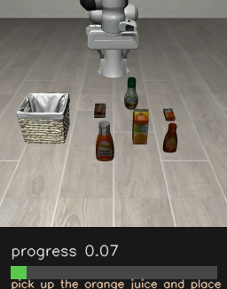
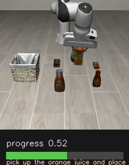
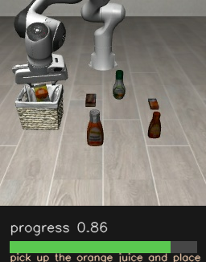

---
language:
- en
license: apache-2.0
pipeline_tag: robotics
tags:
- OpenRAL
- rskill
- nf4
- 4-bit
- any
- reward
- reward-model
- robot-learning
- progress-estimation
- success-detection
- zero-shot
- qwen3-vl
- bitsandbytes
base_model:
- Qwen/Qwen3-VL-4B-Instruct
base_model_relation: quantized
inference: false
---

# rskill-topreward-qwen3vl-4b-nf4

> **OpenRAL rSkill** — [TOPReward](https://arxiv.org/abs/2602.19313) (*Token
> Probabilities as Hidden Zero-Shot Rewards for Robotics*) packaged as an NF4
> `reward` rSkill on top of **lerobot 0.6.0**'s first-party TOPReward. It is a
> **zero-shot** reward: it asks an off-the-shelf **Qwen3-VL-4B** VLM how likely
> the task instruction is, conditioned on the rollout video, and reads
> `log P("True")` back as the signal. Per-frame **progress (0–1)** comes from a
> prefix sweep. **No actuators. Advisory-only.** Apache-2.0 packaging (upstream
> method MIT; Qwen3-VL-4B-Instruct weights are also Apache-2.0).

## Preview

Per-frame progress overlay on **LIBERO `libero_object` episode 0** — task *"pick
up the orange juice and place it in the basket"* — scored live with the NF4
Qwen3-VL-4B backbone (peak **3.13 GB**, RTX 4070 Laptop 8 GB):

| Start of episode | Mid-reach | Object placed |
| :---: | :---: | :---: |
|  |  |  |
| progress **0.07** | progress **0.52** | progress **0.86** |

> HF model cards render images but do not embed HTML5 `<video>`, so the three
> frames above (start / middle / end) stand in for the clip. The full overlay
> video is **[`media/progress.mp4`](media/progress.mp4)** in this repo
> (143 frames, downloadable). Regenerate everything with
> `tools/topreward_per_frame_demo.py --media-dir media`.

## Quick Start

```bash
ral skill install hf://OpenRAL/rskill-topreward-qwen3vl-4b-nf4
```

```python
from openral_core.schemas import RSkillManifest

manifest = RSkillManifest.from_yaml("rskills/topreward-qwen3vl-4b-nf4/rskill.yaml")
assert manifest.kind == "reward"
assert manifest.role == "s2"
assert manifest.reward.progress_range == (0.0, 1.0)
```

## What It Does

Runs **parallel** to a VLA policy and scores the rollout so the Reasoner can
tell whether a skill is making progress or is done — without any hand-written
success detector. Given the rollout's RGB frames plus the task instruction it
produces a **per-frame normalized progress signal in [0, 1]**, queried on demand
by the Reasoner. It never actuates and never gates motors; its output
is advisory input to the replanning ladder.

| Field | Value |
| --- | --- |
| Actions | `monitor` |
| Objects | task progress, task success |
| Scenes | tabletop, kitchen, indoor, manipulation |
| Embodiment | `any` (embodiment-agnostic reward monitor) |

## Why a reward model alongside the VLA

The VLA emits actions but no notion of "am I done / am I stuck". TOPReward fills
that gap **zero-shot** — no reward head to train, no per-task labels. Because it
is a frozen general VLM prompted with the instruction, it transfers across
embodiments and tasks, at the cost of an uncalibrated (per-episode min-max)
scale rather than a physically-calibrated success bar.

## How it works — architecture and upstream model

TOPReward's model (`lerobot.rewards.topreward.TOPRewardModel`) wraps
`transformers`' `Qwen3VLForConditionalGeneration`. It builds the prompt

```text
<video> The above video shows a robot manipulation trajectory that completes the
following task: <instruction> Decide whether the above statement is True or not.
The answer is: True
```

label-masks all but the final token, and returns
`log P("True" | video, instruction)` as **one clip-level scalar**.

**Per-frame progress** is lerobot's native prefix sweep
(`lerobot.rewards.topreward.compute_rabc_weights`): score growing trajectory
prefixes `frames[0:k]` at a set of anchor lengths, **min-max normalise the raw
log-probs per episode**, then interpolate back to one value per frame — a
`[0, 1]` progress curve. The OpenRAL runtime feeds this the same rolling RGB
buffer the co-active VLA uses.

- **Backbone:** `Qwen/Qwen3-VL-4B-Instruct` (zero-shot; no fine-tuned weights).
- **Quantization:** NF4 (bitsandbytes, double-quant, bf16 compute). lerobot's
  `TOPRewardModel` loads bf16 with no quant knob, so the OpenRAL backend
  subclasses it to inject a `BitsAndBytesConfig`
  (see `tools/topreward_per_frame_demo.py::NF4TOPRewardModel`).
- **transformers:** 5.x works directly — no version downgrade pin.

## Runtime

### Inference contract

| Direction | Key | Shape | Notes |
| --- | --- | --- | --- |
| in | rolling RGB window | `(T, 3, H, W)` uint8/float | same camera stream as the VLA |
| in | task instruction | `str` | required (`instruction_required: true`) |
| out | per-frame progress | `(T,)` float in `[0, 1]` | prefix sweep + per-episode min-max |

Each prefix forward is capped to **8 frames** (evenly tail-cropped) to bound the
Qwen3-VL video activation on 8 GB.

### Validated live

Run on **RTX 4070 Laptop (8 GB)** against real LIBERO `libero_object` episode 0
(143 frames, a success demo) via `tools/topreward_per_frame_demo.py`:

| Metric | Value |
| --- | --- |
| Backbone | Qwen3-VL-4B-Instruct (NF4) |
| Peak VRAM | **3.13 GB** |
| Progress, first 20% of episode | 0.41 |
| Progress, last 20% of episode | 0.92 |
| Curve | rises 0 → 1 as the juice reaches the basket |

## Supported robots and embodiments

Embodiment-agnostic (`embodiment_tags: ["any"]`). A reward monitor scores any
rollout video + task instruction, so it is exempt from the rSkill↔robot
embodiment gate. Validated on a Franka Panda LIBERO scene; nothing
about the model is Franka-specific.

## Sensors and Observation Contract

Consumes one RGB camera stream (`modality: rgb`, ≥ 224×224) — the same frames
the co-active VLA observes. **No actuators required.** The instruction string is
supplied by the Reasoner from the active task.

## Manifest Summary

| Field | Value |
| --- | --- |
| `name` | `OpenRAL/rskill-topreward-qwen3vl-4b-nf4` |
| `kind` | `reward` |
| `role` | `s2` |
| `weights_uri` | `hf://Qwen/Qwen3-VL-4B-Instruct` (zero-shot backbone) |
| `quantization` | NF4 / bitsandbytes (`int4`, bf16 compute) |
| `min_vram_gb.int4` | 3.2 (measured 3.13 peak) |
| `reward.progress_range` | `[0.0, 1.0]` |
| `reward.success_threshold` | `0.8` (advisory; uncalibrated) |
| `reward.target_fps` | `2.0` |
| `paper_url` | https://arxiv.org/abs/2602.19313 |

See [`rskill.yaml`](rskill.yaml) for the full manifest.

## License

rSkill **packaging** is **Apache-2.0** (all OpenRAL code is uniformly
Apache-2.0). The TOPReward **method** is MIT. The wrapped
**Qwen3-VL-4B-Instruct weights are also Apache-2.0** (`Qwen/Qwen3-VL-4B-Instruct`,
`license: apache-2.0`), so an NF4-quantized copy is freely redistributable — the
whole stack is Apache-2.0 / MIT. Cite the
[TOPReward paper](https://arxiv.org/abs/2602.19313) (Chen et al., 2026).
